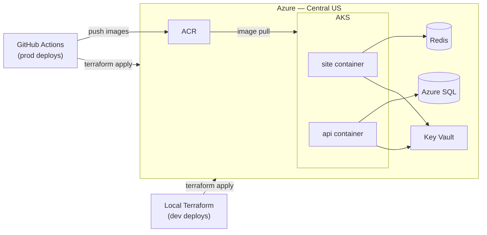

# rxnt-azure-platform

Terraform infrastructure for deploying the [RXNT marketing site](https://github.com/RXNT/site-mkt) to Azure Kubernetes Service. Designed as a reusable, production-grade template for containerized app deployments.

## Architecture



**Two containerized services:**

| Service | Purpose |
|---------|---------|
| `site` | Frontend — serves "hello world" + current date, cached in Redis (5s TTL) |
| `api`  | Backend — reads from Azure SQL Server |

**Azure resources:**

| Resource | SKU | Notes |
|----------|-----|-------|
| AKS | `Standard_D2s_v3` nodes | VMSS node pool for autoscaling |
| ACR | Basic | AKS pulls via kubelet managed identity — no registry credentials stored |
| Azure SQL | Basic DTU | |
| Redis | Basic C0 | |
| Key Vault | Standard | Stores all three connection strings |
| VNet | `10.20.0.0/16` | AKS nodes `/23`, private endpoints `/24` |

## Repository Structure

```
modules/
  network/        VNet + subnets
  data/           SQL, Redis, Key Vault + secrets
  compute/        AKS, ACR, AcrPull role assignment
environments/
  dev/            Local apply — lightweight defaults (1 node)
  prod/           GitHub Actions deploy on merge to main (2 nodes)
.github/
  workflows/
    terraform.yml Plan on PR, apply on merge to main
```

## Prerequisites

- [Terraform](https://developer.hashicorp.com/terraform/install) >= 1.14
- [Azure CLI](https://learn.microsoft.com/en-us/cli/azure/install-azure-cli)
- An Azure subscription
- A Service Principal with Contributor + User Access Administrator roles (see below)

### Create the Service Principal

```bash
az ad sp create-for-rbac --name rxnt-assessment-sp --role Contributor \
  --scopes /subscriptions/<subscription-id>

# Grant User Access Administrator so Terraform can assign AcrPull to the kubelet identity
az role assignment create \
  --assignee <sp-client-id> \
  --role "User Access Administrator" \
  --scope /subscriptions/<subscription-id>
```

## Local Dev Deployment

```bash
cd environments/dev

# Create terraform.tfvars from the example and fill in your SP credentials
cp terraform.tfvars.example terraform.tfvars
# Edit terraform.tfvars with your subscription_id, client_id, client_secret, tenant_id

terraform init
terraform plan
terraform apply

# Get AKS credentials after apply
az aks get-credentials --resource-group rxnt-marketing-rg-dev --name rxntmktdev-aks
```

Terraform automatically loads `terraform.tfvars` when it exists in the working directory — no `-var-file` flag needed.

Always run `terraform destroy` between test iterations to stay within free tier limits.

## Production Deployment (GitHub Actions)

Production deploys run automatically via GitHub Actions — `terraform plan` on every PR, `terraform apply` on merge to `main`. No secrets are stored in GitHub; authentication uses OIDC (Workload Identity Federation).

No `terraform.tfvars` is used for prod. Auth comes from the three `ARM_*` environment variables set in GitHub Actions secrets, and all other variables have production defaults defined in `environments/prod/variables.tf`.

### One-time setup

**1. Bootstrap remote state storage**

```bash
az group create --name rg-terraform-state --location eastus

az storage account create \
  --name rxntterraformstate \
  --resource-group rg-terraform-state \
  --location eastus \
  --sku Standard_LRS

az storage container create --name tfstate --account-name rxntterraformstate
```

The storage account is intentionally created in East US rather than Central US (the infrastructure region). This keeps it independent of the infrastructure it tracks — if you destroy or migrate an environment, the state is unaffected. It also lives in its own resource group (`rg-terraform-state`) outside of Terraform's management so `terraform destroy` can never touch it.

Then uncomment the `backend "azurerm"` block in `environments/prod/providers.tf` and run `terraform init` once to migrate state.

**2. Add a federated credential to the Service Principal**

In the Azure Portal, navigate to **App registrations → rxnt-assessment-sp → Certificates & secrets → Federated credentials → Add credential**:

| Field | Value |
|-------|-------|
| Scenario | GitHub Actions |
| Organization | your GitHub username |
| Repository | `rxnt-azure-platform` |
| Entity type | Branch |
| Branch | `main` |
| Name | `github-actions-prod-main` |

Leave Issuer and Audience at their defaults.

**3. Add GitHub Actions secrets**

In your repo: **Settings → Secrets and variables → Actions → New repository secret**

| Secret name | Where to find the value |
|-------------|------------------------|
| `AZURE_CLIENT_ID` | SP application (client) ID |
| `AZURE_TENANT_ID` | Azure AD tenant ID |
| `AZURE_SUBSCRIPTION_ID` | Azure subscription ID |

No `client_secret` is needed — the federated credential handles authentication via OIDC token exchange.

**4. Configure the prod environment with a required reviewer**

In your repo: **Settings → Environments → New environment** → name it `prod` → add yourself (or a teammate) as a required reviewer.

This creates a manual approval gate on the apply job — merging to main triggers the plan automatically, but apply pauses and waits for a human to approve before any infrastructure changes run.

**5. Push to trigger the workflow**

The workflow runs on any push or PR that changes `environments/prod/**` or `modules/**`.

On a **pull request**: the `Plan` job runs and posts the Terraform plan as a comment.

On **merge to main**: the `Plan` job runs first, then the `Apply` job pauses for reviewer approval. Once approved, it applies the exact plan that was reviewed — not a fresh one.

## Destroying Infrastructure

A separate manually-triggered workflow handles destroy so it can never run accidentally.

**Actions → Terraform Destroy → Run workflow**, then:

1. Select the environment (`dev` or `prod`)
2. Type `destroy` in the confirmation field
3. Click **Run workflow**

The job aborts immediately if the confirmation input is anything other than `destroy`.

The `prod` environment required reviewer (configured in step 4 above) also applies here — a second person must approve before the destroy job executes against prod.

## Build and Push Images

After `terraform apply`, push your container images to ACR:

```bash
ACR=$(terraform -chdir=environments/dev output -raw acr_login_server)

az acr login --name $ACR

docker build -f Dockerfile.site -t $ACR/site:latest .
docker push $ACR/site:latest

docker build -f Dockerfile.api -t $ACR/api:latest .
docker push $ACR/api:latest
```

## Design Decisions

**AKS over Container Apps** — AKS demonstrates deeper Kubernetes/infrastructure expertise and supports the autoscaling requirement (10am–8pm EST traffic pattern) via VMSS node pools and HPA.

**AcrPull via kubelet managed identity** — AKS pulls images from ACR using a system-assigned identity and role assignment. No registry credentials are stored anywhere.

**OIDC for CI authentication** — GitHub Actions authenticates to Azure via Workload Identity Federation. No long-lived `client_secret` is stored in GitHub secrets; the federated credential is scoped to a specific repo and branch.

**Key Vault access policy model** — RBAC authorization disabled; the SP gets a direct access policy with only the required secret permissions (`Get`, `List`, `Set`, `Delete`, `Recover`, `Purge`).

**Random suffixes for global uniqueness** — ACR, SQL Server, Redis, and Key Vault names require globally unique Azure names. A `random_string` suffix is appended to avoid collisions across deployments and forks.

**Explicit `depends_on` on subnets and SQL DB** — Azure's control plane can return success on parent resource creation while child API calls briefly 404. Targeted `depends_on` was added only after observing transient failures in real applies — not as a blanket pattern.

**Region: Central US** — East US and East US 2 both failed for this subscription (AKS node SKU rejection + SQL `ProvisioningDisabled`). Central US passed both checks; West US 3 is a confirmed fallback.
